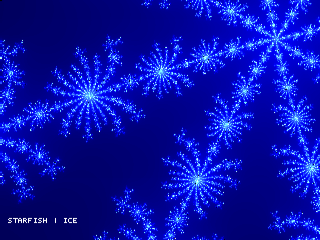
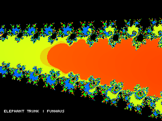
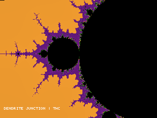
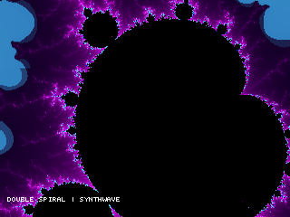
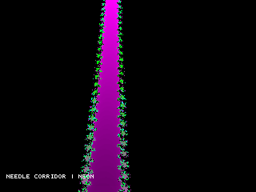
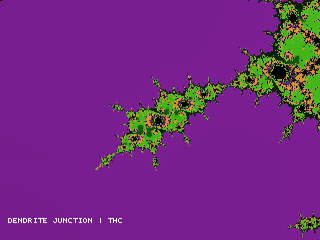
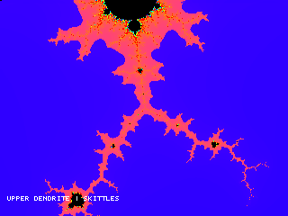

# MiSTerbrot

**Mandelbrot Eye Candy for MiSTer FPGA in 240p**

Real-time Mandelbrot fractal core for MiSTer FPGA. Native 320×240, 8 parallel hardware iterators, 47 palettes, attract mode with 25 Points of Interest and color cycling.

A spiritual successor to digital eye candy from the 90s.

## Screenshots

## Install

Copy `MiSTerbrot_YYYYMMDD.rbf` to `/media/fat/_Other/` on your MiSTer SD card.

## Controls

Keyboard and joystick. Press F12 in the core for help.
