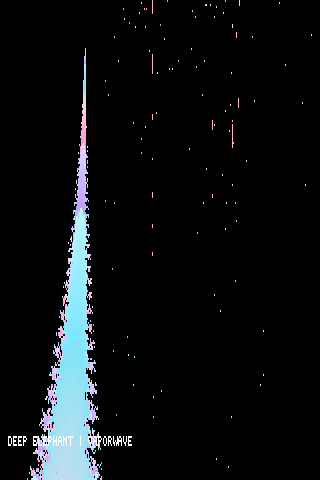
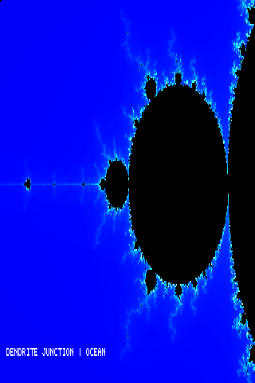
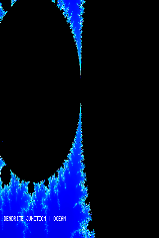
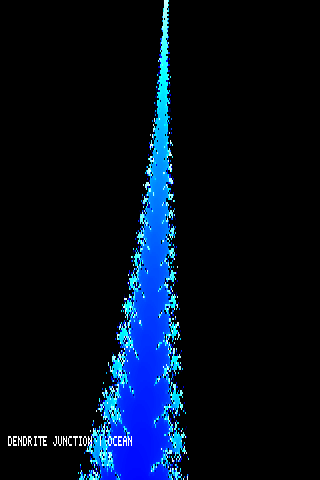
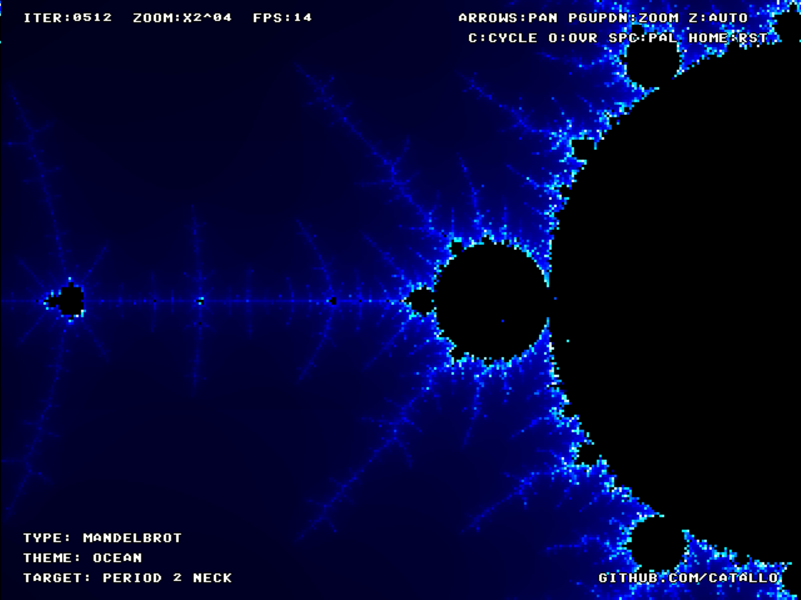

# MiSTerbrot

**Mandelbrot Eye Candy for MiSTer FPGA in 240p**

Spiritual successor to 90s digital eye candy.

A real-time Mandelbrot fractal core for MiSTer FPGA. Native 320×240, 8 parallel hardware iterators, 47 palettes, attract mode with 25 Points of Interest.

## Screenshots

## Install

Copy `MiSTerbrot_YYYYMMDD.rbf` to `/media/fat/_Other/` on your MiSTer SD card.

## Controls

Keyboard and joystick. Press F12 in the core for help.
