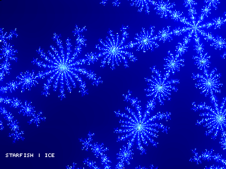
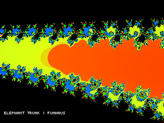
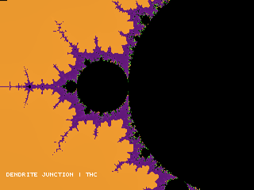
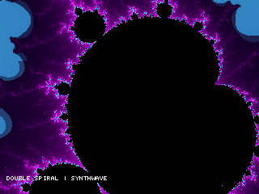
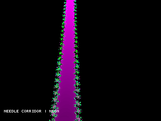
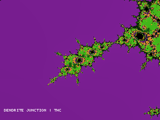
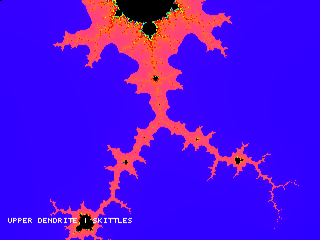

# MiSTerbrot

**Mandelbrot Eye Candy for MiSTer FPGA in 240p**

Real-time Mandelbrot fractal core for MiSTer FPGA. Runtime-selectable 320×240 / 640×240 native 240p output, 20 parallel hardware iterators on a dual-clock pipeline (50 MHz / 100 MHz), 47 palettes, attract-mode zoom through 74 cross-validated canonical Mandelbrot POIs (Seahorse, Elephant, Triple Spiral, Misiurewicz, Feigenbaum, period-N bulbs and minibrots, embedded Julia sets) with color cycling.

A spiritual successor to digital eye candy from the 90s.

## Screenshots









## Install

1. Download [`MiSTerbrot_20260404.rbf`](https://github.com/catallo/MiSTerbrot/releases/latest) from the latest release
2. Copy to `/media/fat/_Other/` on your MiSTer SD card
3. Launch from the MiSTer menu under Other

## Controls

Keyboard and joystick. Press F12 in the core for help.

## Building

The core targets MiSTer-standard Quartus 17.0.2 Lite. Two ways:

### Docker (recommended)

```bash
docker run --rm -v $(pwd):/build ryanfb/quartus-mister bash -c \
  "export PATH=/opt/intelFPGA_lite/17.0/quartus/bin:\$PATH && \
   export LD_LIBRARY_PATH=/opt/intelFPGA_lite/17.0/quartus/linux64:\$LD_LIBRARY_PATH && \
   quartus_sh --flow compile /build/MiSTerbrot"
```

The `ryanfb/quartus-mister` image ships Quartus 19.1 by default, so the explicit `PATH`/`LD_LIBRARY_PATH` exports above are required to use the MiSTer-standard 17.0.2 toolchain. A full compile takes ~17 minutes on a modern laptop.

Output lands in `output_files/MiSTerbrot.rbf`. **You must rename it** to `MiSTerbrot_YYYYMMDD.rbf` before deploying — MiSTer reads the build date from the filename suffix, not from the core's CONF_STR.

### Native Quartus (if you have it installed locally)

```bash
quartus_sh --flow compile MiSTerbrot
```

### Deploy

```bash
scp MiSTerbrot_$(date +%y%m%d).rbf root@<mister-ip>:/media/fat/_Other/
ssh root@<mister-ip> "echo 'load_core /media/fat/_Other/MiSTerbrot_$(date +%y%m%d).rbf' > /dev/MiSTer_cmd"
```

Default credentials are `root`/`1`.

### Regenerating the POI playlist

The 74-POI auto-zoom playlist is generated from `tools/poi_master.json`:

```bash
# 1. Edit tools/poi_master.json (add/remove/retune POIs)
# 2. Render thumbnails for visual verification:
python3 tools/poi_render.py
# 3. Generate the Verilog include file:
python3 tools/poi_encode.py   # writes rtl/poi_generated.vh
# 4. Rebuild the core (Docker command above)
```

Requires Python 3 with `numpy` and `Pillow`.

## Architecture

The core uses a parallel pixel pipeline with 20 logical iterators, implemented as 4 `iter_quad` modules that 5-context-time-share their DSP multipliers across two clock domains (50 MHz `clk_sys` / 100 MHz `clk_iter`, with toggle synchronizers at the iter_quad CDC boundary). Every iterator runs 64-bit fixed-point arithmetic in 8.56 format (8 integer bits, 56 fractional), giving ~17 decimal digits of precision and a theoretical max zoom of around 7.2 × 10¹⁶×.

The complex multiply z² uses a truncated 64×64 approach — split into 32-bit halves and mapped to DSP blocks via `multstyle="dsp"`. Each `iter_quad` uses 7 physical DSP multiplies shared between 5 pixel contexts.

Pixels are dispatched round-robin from a coordinate generator (scanning left-to-right, top-to-bottom) to whichever iterator slot is free. Results are collected in order and written to a BRAM double-framebuffer sized for 640×240 (used for both modes). Buffer swaps happen only on the VBLANK rising edge — zero tearing.

Output is native 240p @ ~59.7 Hz (15.6 kHz line rate), 320×240 or 640×240 selectable at runtime via the OSD. The MiSTer framework handles upscaling for HDMI output.

## Resource Utilization (Cyclone V, DE10-Nano)

- ALMs: 61% (25,568 of 41,910)
- DSP blocks: 100% (fully saturated by the fixed-point multipliers)
- Block RAM (M9K): 78% (429 of 553 blocks — framebuffer sized for 640×240 + color LUTs)
- PLLs: 50% (3 of 6)
- Closes timing at clk_iter = 100 MHz.

Frame rate is highly scene-dependent — it ranges from ~4 fps in deeply zoomed, high-iteration areas up to ~60 fps in simple regions near the escape boundary. The bottleneck is purely computational: every pixel must iterate z = z² + c until either |z| > 2 or the iteration limit (up to 2048) is hit.
